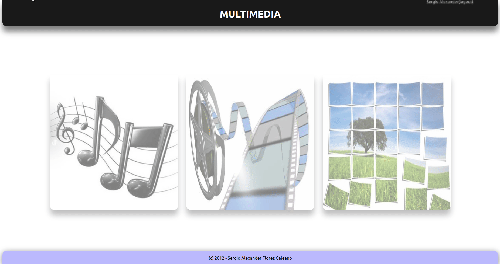
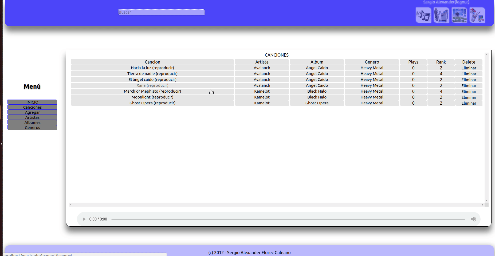
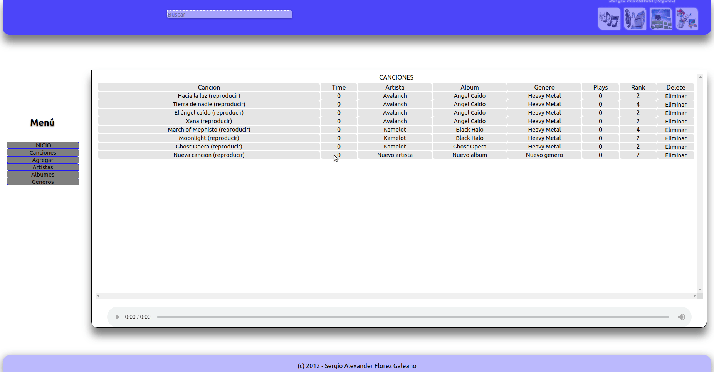
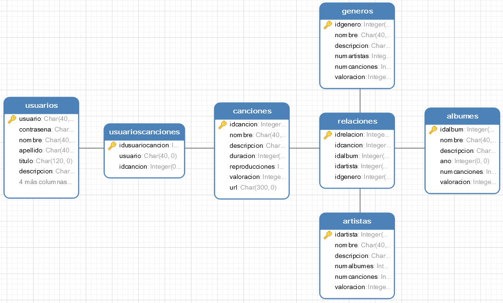

# Librería Musical en PHP

### Historia

Llevo casi 10 años desarrollando para la web, pero como todos no nací aprendido; hace poco estuve desempolvando mis archivos de la Universidad y me encontre con la primera web que desarrollé, hace ya mucho mucho tiempo, era parte del proyecto final del curso de bases de datos, en la cual debía desarrollar algún sistema que permitiera aplicar todos los conocimientos adquiridos durante el curso, definir un modelo de datos para una base de datos relacional y permitir hacer consultas de todo tipo; no importaba en que lenguaje o tecnología, y allí fue donde tuve mi primer acercamiento con el desarrollo web.

Despues de investigar un poco al respecto, evaluar pros y contras, me incline por usar el conjunto de tecnologías compuesto por: PHP, SQlite, HTML y Css (no use javascript), era mi primera vez usando estas tecnologías juntas, había mucho que digerir pero finalmente logre presentar un producto final, el cual consistía en una biblioteca musical, que te permite crear una cuenta de usuario, almacenar tus canciones favoritas y poder reproducirlas.

¿Suena simple no? pues si, pero constaba de poco tiempo para desarrollarlo, y si recien te inicias en este mundo veamos todo lo que implicaba desarrollar esta aplicación:

1. Comprender como desarrollar para web, como instalar un servidor (por esos tiempos use el popular [XAMPP](https://www.apachefriends.org/es/index.html)), tener claro que tenía un par de tecnologías que operan del lado del servidor (PHP y SQlite) y otras del lado del cliente (HTML, Css y Javascript).
2. Montar el modelo de datos en SQlite.
3. Aprender como comunicar y operar en PHP con la base de datos almacenada en el formato portable de SQlite.
4. Crear un CRUD para cada modelo en la base de datos.
5. Comunicar cliente y servidor.
6. Maquetar interfaces (HTML + Css).
7. Manejo de archivos en PHP (Transferir y almacenar los archivos de las canciones de forma estructurada en el servidor).
8. Manejo de sesiones de usuario en PHP (Crear y registrar usuarios, activar y destruir sesiones).

Creo que con lo anterior resumo muy bien el trabajo por hacer; por otro lado es importante resaltar que este trabajo se realizo complemente desde cero, sin el uso de librerías o frameworks que facilitáran tareas como el manejo de sesiones, la manipulación de los archivos o el maquetado de las interfaces. Siempre recomiendo hacerlo así al principio, siendo este un ejercicio enteramente académico y de autoaprendizaje, es importante tener los conceptos claros, saber que es lo que tu librería o framework hace por debajo y como lo hace, como parte fundamental de la toma de decisiones a la hora de escoger un stack de herramientas con las cuales trabajar.

Si alguien desea ver la web funcionando solo debe instalar la última versión de php; ahora mismo funciona bien con `php7.0` y las extensiones `php7.0-fpm` y `php7.0-sqlite3`.

A continuación comparto algunos gifs que muestran como lucia la aplicación y sus diferentes funcionalidades:

**1. Registro de usuario**

**2. Inicio, login y listado de canciones**

**3. Agregar canciones, artistas, generos y albumes**

**4. Busqueda de canciones**

**5. Modelo de datos**

Finalmente como ya he aclarado antes, este fue mi primer acercamiento con el desarrollo web, no van a encontrar un código bonito o bien documentado, ni que siga los mejores estandares y prácticas de desarrollo, solo encontraran los mejores esfuerzos que un estudiante de ciencias de la computación transnochado y agobiado por la carga academíca pudo lograr en un breve periodo de tiempo.

Espero que hayan disfrutado leer esta corta historia y espero que algún día este código le pueda servir de algo a alguien.

--

*“La inteligencia consiste no sólo en el conocimiento, sino también en la destreza de aplicar los conocimientos en la práctica”*
*-- Aristóteles*
